# 📊 DFD Level 0 - AllFootsal Booking System (Context Diagram)

**Document Version:** 1.0  
**Last Updated:** June 2026  
**Created for:** AllFootsal Futsal Booking Platform

---

## 📋 Table of Contents

1. [Overview](#overview)
2. [Purpose](#purpose)
3. [System Boundary](#system-boundary)
4. [External Entities](#external-entities)
5. [Level 0 DFD Diagram](#level-0-dfd-diagram)
6. [Data Flow Summary](#data-flow-summary)
7. [Key Characteristics](#key-characteristics)

---

## Overview

**Level 0 DFD** (Context Diagram) represents the **highest level of abstraction** of the AllFootsal Booking System. It shows:
- The system as a **single black box process**
- All **external entities** (users, actors, systems) interacting with it
- The **major data flows** between the system and external entities
- The **system boundary**

This diagram is the starting point for understanding how the system interacts with the outside world.

---

## Purpose

The Level 0 DFD serves to:
✅ Provide a **high-level overview** of the system  
✅ Define the **system boundary** clearly  
✅ Identify all **external actors and systems**  
✅ Show **major categories of data flows**  
✅ Serve as a **reference point** for detailed levels  
✅ Help stakeholders understand **system scope**  

---

## System Boundary

```
┌─────────────────────────────────────────────────────────────────┐
│                     SYSTEM BOUNDARY                              │
│                                                                  │
│  ┌───────────────────────────────────────────────────────────┐  │
│  │                                                           │  │
│  │      AllFootsal Booking System (Process 0)              │  │
│  │                                                           │  │
│  │  • User Management & Authentication                      │  │
│  │  • Facility Management                                   │  │
│  │  • Booking Engine                                        │  │
│  │  • Payment Processing                                    │  │
│  │  • Community & Reviews                                   │  │
│  │  • Analytics & Reporting                                 │  │
│  │  • Admin Dashboard                                       │  │
│  │  • Notification System                                   │  │
│  │  • Multi-Tenant Support                                  │  │
│  │                                                           │  │
│  └───────────────────────────────────────────────────────────┘  │
│                                                                  │
└─────────────────────────────────────────────────────────────────┘

EXTERNAL WORLD ───────────────────────────────────────────────────
```

---

## External Entities

### **1. 👤 User (Customer)**
**Definition:** Registered customers who browse, book futsal slots, and make payments

**Interactions:**
- Register and login to platform
- Search and browse futsal facilities
- View available time slots
- Make bookings for futsal games
- Process payments online
- Post reviews and ratings
- Participate in community forums
- Receive notifications and confirmations

**Data Provided:**
- Registration data (email, phone, password)
- Search preferences and filters
- Booking details (slot selection, date, time)
- Payment information
- Reviews and ratings
- Forum posts and comments

**Data Received:**
- Facility listings and details
- Available slots and pricing
- Booking confirmations and receipts
- Community discussions and ratings
- Notifications and alerts
- Payment status updates

---

### **2. 🏢 Futsal Owner (Facility Manager)**
**Definition:** Facility owners who manage their futsal and subscription

**Interactions:**
- Register their futsal facility
- Manage pitches and courts
- Set pricing and availability
- Configure time slots
- Manage subscription plans
- Track bookings and revenue
- Upload facility media (images/videos)
- Receive booking notifications
- Respond to reviews
- Access analytics and reports
- Manage offline bookings

**Data Provided:**
- Facility registration info (name, location, contact)
- Pitch details (type, capacity, surface)
- Pricing and subscription plans
- Payment gateway configurations
- Media files (images, videos)
- Facility information (hours, amenities)
- Offline booking records

**Data Received:**
- Facility verification status
- Booking alerts and requests
- Revenue and analytics reports
- Payment history
- Customer reviews and feedback
- Dashboard and performance metrics

---

### **3. 👨‍💼 Admin (Super Administrator)**
**Definition:** Platform administrators who manage users, facilities, and transactions

**Interactions:**
- Login to admin dashboard
- Verify users and facilities
- Monitor system transactions
- Handle disputes and complaints
- View platform analytics
- Send announcements
- Block/unblock users or facilities
- Review payment records
- Generate reports
- System monitoring and maintenance

**Data Provided:**
- Admin credentials
- Verification actions
- User/facility management commands
- Complaint resolution decisions
- System announcements

**Data Received:**
- Complete system analytics
- All user and facility records
- Transaction history
- Platform metrics and KPIs
- System logs and alerts
- Revenue and performance data

---

### **4. 💳 Payment Gateway (External Service)**
**Definition:** Third-party payment processing systems (Khalti, Esewa, Stripe)

**Interactions:**
- Process customer payments
- Process subscription fees
- Provide payment confirmations
- Return transaction status
- Support refunds and reversals
- Provide webhook callbacks

**Data Provided:**
- Payment request details
- Amount and currency
- Customer information
- Transaction metadata

**Data Received:**
- Payment confirmation
- Transaction ID
- Payment status (success/failure)
- Receipt information

---

### **5. 📧 Email Service (External Service)**
**Definition:** Email delivery service (Nodemailer) for sending transactional emails

**Interactions:**
- Send registration confirmations
- Send password reset emails
- Send booking confirmations
- Send payment receipts
- Send review notifications
- Send announcements
- Send alerts and reminders

**Data Provided:**
- Recipient email addresses
- Email subject and content
- Recipient list (bulk emails)

**Data Received:**
- Email delivery status
- Bounce notifications

---

### **6. 📸 Cloud Storage (External Service)**
**Definition:** Cloud storage service (Cloudinary) for media hosting and CDN

**Interactions:**
- Upload facility images and videos
- Store media files
- Retrieve media URLs
- Delete media files
- Optimize and transform images

**Data Provided:**
- Media files (images, videos)
- File metadata
- Transformation parameters

**Data Received:**
- CDN URLs for stored media
- File metadata and status

---

### **7. 📱 SMS/Notification Service (External Service)**
**Definition:** Notification delivery service for push notifications and SMS

**Interactions:**
- Send booking confirmations via SMS
- Send booking reminders
- Send payment notifications
- Send promotional messages
- Send critical alerts

**Data Provided:**
- Phone numbers
- Recipient device tokens
- Message content

**Data Received:**
- Delivery status
- Bounce/failure notifications

---

## Level 0 DFD Diagram

```mermaid
graph TB
    subgraph "External Entities"
        E1["👤 User<br/>Customer"]
        E2["🏢 Futsal Owner<br/>Facility Manager"]
        E3["👨‍💼 Admin<br/>Super Admin"]
        E4["💳 Payment Gateway<br/>Khalti/Esewa/Stripe"]
        E5["📧 Email Service<br/>Nodemailer"]
        E6["📸 Cloud Storage<br/>Cloudinary"]
        E7["📱 SMS/Notification<br/>Service"]
    end
    
    subgraph "System Boundary"
        SYSTEM["🎯 AllFootsal Booking System<br/>(Process 0)"]
    end
    
    %% User Data Flows
    E1 -->|"1. Register/Login<br/>Search/Browse Futsals"| SYSTEM
    SYSTEM -->|"1.1 Facility Details<br/>Availability & Pricing"| E1
    
    E1 -->|"2. Booking Request<br/>Payment Info"| SYSTEM
    SYSTEM -->|"2.1 Booking Confirmation<br/>Invoice & Receipt"| E1
    
    E1 -->|"3. Reviews, Ratings<br/>Forum Posts"| SYSTEM
    SYSTEM -->|"3.1 Community Content<br/>Discussions"| E1
    
    %% Futsal Owner Data Flows
    E2 -->|"4. Register Facility<br/>Manage Pitches/Pricing"| SYSTEM
    SYSTEM -->|"4.1 Facility Dashboard<br/>Analytics & Reports"| E2
    
    E2 -->|"5. Subscription & Config<br/>Payment Methods"| SYSTEM
    SYSTEM -->|"5.1 Subscription Status<br/>Payment History"| E2
    
    E2 -->|"6. Upload Media<br/>Update Info & FAQ"| SYSTEM
    SYSTEM -->|"6.1 Facility Profile<br/>Visitor Analytics"| E2
    
    %% Admin Data Flows
    E3 -->|"7. System Management<br/>User Verification"| SYSTEM
    SYSTEM -->|"7.1 Admin Dashboard<br/>Platform Analytics"| E3
    
    E3 -->|"8. Monitor Transactions<br/>Resolve Disputes"| SYSTEM
    SYSTEM -->|"8.1 Transaction Report<br/>User Reports"| E3
    
    %% Payment Gateway Flows
    SYSTEM -->|"10. Process Payment<br/>Verify Transaction"| E4
    E4 -->|"10.1 Payment Status<br/>Receipt"| SYSTEM
    
    %% Email Service Flows
    SYSTEM -->|"12. Send Emails<br/>Confirmations & Alerts"| E5
    E5 -->|"12.1 Email Delivery<br/>Status"| SYSTEM
    
    %% Cloud Storage Flows
    SYSTEM -->|"14. Store/Retrieve<br/>Media Files"| E6
    E6 -->|"14.1 Media URLs<br/>Metadata"| SYSTEM
    
    %% Notification Service Flows
    SYSTEM -->|"15. Send Notifications<br/>SMS/Push Alerts"| E7
    E7 -->|"15.1 Delivery Status"| SYSTEM
    
    style SYSTEM fill:#4A90E2,stroke:#2E5C8A,stroke-width:3px,color:#fff
    style E1 fill:#50C878,stroke:#2D7A4A,stroke-width:2px,color:#fff
    style E2 fill:#FF6B6B,stroke:#8B3A3A,stroke-width:2px,color:#fff
    style E3 fill:#9966FF,stroke:#5A3A99,stroke-width:2px,color:#fff
    style E4 fill:#FFB84D,stroke:#8B6914,stroke-width:2px,color:#fff
    style E5 fill:#00BCD4,stroke:#004D5C,stroke-width:2px,color:#fff
    style E6 fill:#FF9800,stroke:#8B5A00,stroke-width:2px,color:#fff
    style E7 fill:#E91E63,stroke:#8B0000,stroke-width:2px,color:#fff
```



---

## Data Flow Summary

### **All Data Flows at Level 0**

| Flow ID | From | To | Data Elements | Purpose |
|---------|------|----|----|---------|
| **D1** | User | System | Credentials, Email, Password | User Registration/Login |
| **D1.1** | System | User | Profile, Available Facilities, Filters | Display Facility Listing |
| **D2** | User | System | Location, Dates, Filters | Search Futsals |
| **D2.1** | System | User | Pitches, Time Slots, Pricing, Reviews | Show Facility Details |
| **D3** | User | System | Slot Selection, Booking Date, Amount | Create Booking |
| **D3.1** | System | User | Booking ID, Confirmation, Invoice | Booking Confirmation |
| **D4** | User | System | Payment Gateway, Amount, Card Info | Initiate Payment |
| **D4.1** | System | Payment Gateway | Payment Request, Amount, Details | Process Payment |
| **D4.2** | Payment Gateway | System | Transaction ID, Status, Receipt | Payment Response |
| **D4.3** | System | User | Receipt, Confirmation, Email | Payment Confirmation |
| **D5** | User | System | Rating, Review Text, Images | Post Review |
| **D5.1** | System | User | Review Confirmation | Display Confirmation |
| **D6** | User | System | Forum Post, Reply, Like | Community Interaction |
| **D6.1** | System | User | Forum Threads, Replies, Discussions | Show Community |
| **D7** | Futsal Owner | System | Facility Info, Contact Details | Register Facility |
| **D7.1** | System | Futsal Owner | Facility Code, Verification Status | Registration Confirmation |
| **D8** | Futsal Owner | System | Pitch Data, Type, Price, Capacity | Add/Update Pitches |
| **D8.1** | Futsal Owner | System | Time Slots, Pricing, Operating Hours | Set Availability |
| **D9** | System | Futsal Owner | Booking List, Revenue, Analytics | Dashboard Display |
| **D10** | Futsal Owner | System | Media Files, Images, Videos | Upload Content |
| **D10.1** | System | Cloud Storage | Media File, Metadata | Store Media |
| **D10.2** | Cloud Storage | System | CDN URL, Media Link | Get Media Link |
| **D10.3** | System | Futsal Owner | Media URL, Display Link | Show in Profile |
| **D11** | Futsal Owner | System | Subscription Plan Selection | Choose Subscription |
| **D11.1** | System | Futsal Owner | Subscription Details, Invoice | Subscription Confirmation |
| **D12** | Futsal Owner | System | Payment Gateway Config | Setup Payment Method |
| **D12.1** | System | Payment Gateway | Subscription Fee, Amount | Submit Payment |
| **D12.2** | Payment Gateway | System | Payment Confirmation, Receipt | Transaction Success |
| **D12.3** | System | Futsal Owner | Payment Receipt, Confirmation | Verify Payment |
| **D13** | Admin | System | Admin Credentials | Admin Login |
| **D13.1** | System | Admin | Dashboard, Analytics, KPIs | Admin Dashboard |
| **D14** | Admin | System | User ID, Verification Action | Verify/Block User |
| **D14.1** | System | Admin | User Details, Status | Display User Info |
| **D15** | Admin | System | Facility ID, Verification Action | Verify/Block Facility |
| **D15.1** | System | Admin | Facility Details, Status | Display Facility Info |
| **D16** | Admin | System | Report Details, Analysis Request | Generate Reports |
| **D16.1** | System | Admin | Report Data, Analytics, Charts | Display Reports |
| **D17** | System | Email Service | Recipients, Subject, Content | Send Emails |
| **D17.1** | Email Service | System | Delivery Status, Logs | Email Status |
| **D18** | System | Notification Service | User IDs, Device Tokens, Message | Send Notifications |
| **D18.1** | Notification Service | System | Delivery Status, Logs | Notification Status |

---

## Key Characteristics

### **Process 0 (System as Black Box)**
- Represents the **entire AllFootsal system**
- All internal processes are **hidden**
- Focuses on **external interactions**
- Shows **system inputs and outputs**
- Defines what the system **does** (not how)

### **External Entities (7 Total)**
- **Humans/Actors**: User, Futsal Owner, Admin
- **External Systems**: Payment Gateway, Email Service, Cloud Storage, Notification Service

### **Data Flow Categories**
1. **User Management**: Registration, Login, Profile
2. **Facility Management**: Registration, Pitches, Pricing
3. **Booking System**: Search, Reserve, Confirmation
4. **Payment Processing**: Transaction, Status, Receipt
5. **Community**: Reviews, Ratings, Forum
6. **Notifications**: Email, SMS, Push
7. **Analytics**: Reports, Metrics, Dashboard
8. **Admin**: Verification, Monitoring, Reports

### **Key System Capabilities**
✅ Multi-user support (customers, owners, admins)  
✅ Facility management and inventory  
✅ Online booking and reservation  
✅ Payment integration (multiple gateways)  
✅ Community engagement (reviews, forums)  
✅ Real-time notifications  
✅ Analytics and reporting  
✅ Admin management tools  
✅ Multi-tenant support (per-facility data isolation)  
✅ Offline booking support  

---

## Next Steps

**For detailed process decomposition, see:**
- 📄 [Level 1 DFD](DFD_LEVEL_1_README.md) - Main processes breakdown
- 📄 [Level 2 DFD](DFD_LEVEL_2_README.md) - Detailed sub-processes

---

## Document Information

- **Diagram Type**: Context Diagram (Level 0)
- **System**: AllFootsal Futsal Booking Platform
- **Created**: June 2026
- **Version**: 1.0
- **Processes Shown**: 1 (System as black box)
- **External Entities**: 7
- **Data Flows**: 40+
