# 📊 DFD Level 1 - AllFootsal Booking System (Main Processes)

**Document Version:** 1.0  
**Last Updated:** June 2026  
**Created for:** AllFootsal Futsal Booking Platform

---

## 📋 Table of Contents

1. [Overview](#overview)
2. [Purpose](#purpose)
3. [Main Processes](#main-processes)
4. [Data Stores](#data-stores)
5. [Level 1 DFD Diagram](#level-1-dfd-diagram)
6. [Process Descriptions](#process-descriptions)
7. [Data Flow Details](#data-flow-details)
8. [Decomposition Strategy](#decomposition-strategy)

---

## Overview

**Level 1 DFD** decomposes the Level 0 black box into **9 main processes** that represent the core functional areas of the AllFootsal system. It shows:

- **9 Main Processes** that handle different business functions
- **Multiple Data Stores** for persistent data storage
- **Data Flows** between processes and data stores
- **External Entities** (same as Level 0)
- **System Boundary**

This level provides visibility into the **major functional areas** while still maintaining a high level of abstraction.

---

## Purpose

The Level 1 DFD serves to:
✅ **Decompose** the system into manageable functional areas  
✅ Show **main business processes** and their relationships  
✅ Identify **data storage requirements**  
✅ Illustrate **inter-process dependencies**  
✅ Provide a **bridge** between context and detailed processes  
✅ Help identify **major system components**  

---

## Main Processes

### **Process 1: User Management & Authentication** (1.0)
**Purpose:** Handle user registration, login, profile management, and authentication

**Inputs:**
- User credentials (email, password)
- Registration data
- Profile updates
- Password reset requests

**Processing:**
- Validate credentials
- Hash passwords
- Manage sessions/tokens
- Update profiles
- Send verification emails

**Outputs:**
- User profiles
- Authentication tokens
- Verification confirmations
- Session information

**Data Stores:** User Database

---

### **Process 2: Facility Management** (2.0)
**Purpose:** Manage futsal facility information, pitches, and facility owner operations

**Inputs:**
- Facility registration info
- Pitch details
- Facility updates
- Media uploads

**Processing:**
- Register facilities
- Create pitch records
- Manage facility information
- Process media uploads
- Track facility status

**Outputs:**
- Facility profiles
- Pitch listings
- Media URLs
- Facility status updates

**Data Stores:** Facility Database, Media Store (Cloud)

---

### **Process 3: Booking System** (3.0)
**Purpose:** Handle booking creation, confirmation, and booking management

**Inputs:**
- Slot selection
- Booking requests
- Booking cancellations
- Offline booking data

**Processing:**
- Validate slot availability
- Create booking records
- Check conflicts (no double booking)
- Update availability
- Manage booking status

**Outputs:**
- Booking confirmations
- Booking records
- Availability updates
- Booking cancellations

**Data Stores:** Booking Database

---

### **Process 4: Payment Processing** (4.0)
**Purpose:** Process payments, manage subscriptions, and handle payment gateway interactions

**Inputs:**
- Payment requests
- Payment details
- Subscription selections
- Gateway responses

**Processing:**
- Validate payment info
- Send payment to gateway
- Verify transactions
- Record payments
- Manage subscriptions
- Handle refunds

**Outputs:**
- Payment confirmations
- Transaction records
- Subscription status
- Payment receipts

**Data Stores:** Payment Database, Subscription Database

---

### **Process 5: Community & Reviews** (5.0)
**Purpose:** Manage user reviews, ratings, and community forum discussions

**Inputs:**
- Review submissions
- Forum posts
- Ratings
- Comments/replies

**Processing:**
- Validate reviews
- Calculate ratings
- Store forum posts
- Process likes/dislikes
- Manage moderation

**Outputs:**
- Review confirmations
- Rating updates
- Forum content
- Community discussions

**Data Stores:** Review Database, Forum Database

---

### **Process 6: Notification Management** (6.0)
**Purpose:** Manage and send notifications to users, owners, and admins

**Inputs:**
- Notification triggers
- User/owner data
- Message content
- Recipient lists

**Processing:**
- Create notification records
- Send emails via email service
- Send SMS/push notifications
- Track delivery status
- Manage notification preferences

**Outputs:**
- Email confirmations
- SMS/push delivery status
- Notification records
- Delivery logs

**Data Stores:** Notification Database, Notification Logs

---

### **Process 7: Admin Dashboard** (7.0)
**Purpose:** Provide admin tools for system management, verification, and monitoring

**Inputs:**
- Admin commands
- Verification requests
- Report requests
- System monitoring data

**Processing:**
- Verify users/facilities
- Block/unblock entities
- Generate reports
- Monitor transactions
- Handle disputes
- Track system metrics

**Outputs:**
- Verification results
- Reports and analytics
- System logs
- Admin notifications

**Data Stores:** Admin Database, Audit Logs

---

### **Process 8: Analytics & Reporting** (8.0)
**Purpose:** Generate analytics, reports, and performance metrics

**Inputs:**
- Booking data
- Payment data
- User activity
- Facility performance

**Processing:**
- Aggregate booking metrics
- Calculate revenue
- Analyze user behavior
- Generate facility reports
- Compute performance KPIs
- Create dashboards

**Outputs:**
- Analytics dashboards
- Performance reports
- Revenue reports
- Facility metrics
- User analytics

**Data Stores:** Analytics Database

---

### **Process 9: Offline Booking Handler** (9.0)
**Purpose:** Handle walk-in bookings and offline reservations by facility owners

**Inputs:**
- Walk-in customer data
- Slot selection
- Payment information
- Booking details

**Processing:**
- Create offline booking
- Validate slot availability
- Record customer info
- Track payment status
- Generate offline receipt

**Outputs:**
- Booking confirmation
- Receipt
- Payment status
- Booking record

**Data Stores:** Booking Database (offline records)

---

## Data Stores

### **Shared Data Stores (Central)**

| ID | Data Store | Purpose | Contents |
|----|----|---------|----------|
| **D1** | User Database | Store user accounts and profiles | Users, authentication, profiles, settings |
| **D2** | Facility Database | Store facility information | Facilities, pitches, owners, locations, info |
| **D3** | Booking Database | Store booking records | Bookings, slots, timeslots, offline bookings |
| **D4** | Payment Database | Store payment records | Payments, transactions, payment configs |
| **D5** | Subscription Database | Store subscription info | Plans, subscriptions, status, history |
| **D6** | Review Database | Store reviews and ratings | Reviews, ratings, sentiment analysis |
| **D7** | Forum Database | Store community discussions | Forum posts, replies, likes, categories |
| **D8** | Notification Database | Store notification records | Notifications, templates, logs, preferences |
| **D9** | Admin Database | Store admin operations | Admin users, verification records, logs |
| **D10** | Analytics Database | Store analytics data | Metrics, KPIs, reports, trends |
| **D11** | Media Store | Cloud storage for media | Images, videos, URLs, metadata (Cloudinary) |
| **D12** | Audit Logs | Store system audit trail | Action logs, error logs, access logs |

---

## Level 1 DFD Diagram

```mermaid
graph TB
    subgraph "External Entities"
        E1["👤 User"]
        E2["🏢 Futsal Owner"]
        E3["👨‍💼 Admin"]
        E4["💳 Payment Gateway"]
        E5["📧 Email Service"]
        E6["📸 Cloud Storage"]
        E7["📱 Notification Service"]
    end
    
    subgraph "Main Processes"
        P1["1.0 User Management<br/>& Authentication"]
        P2["2.0 Facility<br/>Management"]
        P3["3.0 Booking<br/>System"]
        P4["4.0 Payment<br/>Processing"]
        P5["5.0 Community<br/>& Reviews"]
        P6["6.0 Notification<br/>Management"]
        P7["7.0 Admin<br/>Dashboard"]
        P8["8.0 Analytics<br/>& Reporting"]
        P9["9.0 Offline<br/>Booking Handler"]
    end
    
    subgraph "Data Stores"
        DS1[("D1: User<br/>Database")]
        DS2[("D2: Facility<br/>Database")]
        DS3[("D3: Booking<br/>Database")]
        DS4[("D4: Payment<br/>Database")]
        DS5[("D5: Subscription<br/>Database")]
        DS6[("D6: Review<br/>Database")]
        DS7[("D7: Forum<br/>Database")]
        DS8[("D8: Notification<br/>Database")]
        DS9[("D9: Admin<br/>Database")]
        DS10[("D10: Analytics<br/>Database")]
        DS11[("D11: Media<br/>Store")]
        DS12[("D12: Audit<br/>Logs")]
    end
    
    %% User flows
    E1 -->|Registration/Login| P1
    P1 --> DS1
    DS1 --> P1 -->|User Profile| E1
    
    E1 -->|Search Facilities| P2
    P2 --> DS2
    DS2 --> P2 -->|Facility List| E1
    
    E1 -->|Book Slot| P3
    P3 --> DS3
    DS3 --> P3 -->|Booking Confirm| E1
    
    E1 -->|Make Payment| P4
    P4 --> DS4
    P4 --> DS5
    DS4 --> P4
    DS5 --> P4 -->|Payment Status| E1
    
    E1 -->|Post Review| P5
    P5 --> DS6
    P5 --> DS7
    DS6 --> P5 -->|Review Confirm| E1
    DS7 --> P5 -->|Community Content| E1
    
    %% Owner flows
    E2 -->|Register Facility| P2
    P2 --> DS2
    DS2 --> P2 -->|Facility Dashboard| E2
    
    E2 -->|Upload Media| P2
    P2 --> DS11
    DS11 --> P2 -->|Media URLs| E2
    
    E2 -->|View Bookings| P3
    P3 --> DS3
    DS3 --> P3 -->|Booking List| E2
    
    E2 -->|Subscribe| P4
    P4 --> DS5
    P4 --> DS4
    DS5 --> P4 -->|Subscription Status| E2
    DS4 --> P4 -->|Payment Receipt| E2
    
    E2 -->|Offline Booking| P9
    P9 --> DS3
    DS3 --> P9 -->|Booking Confirm| E2
    
    %% Admin flows
    E3 -->|Login| P1
    P1 --> DS1
    DS1 --> P1 -->|Admin Access| E3
    
    E3 -->|Verify/Monitor| P7
    P7 --> DS1
    P7 --> DS2
    P7 --> DS4
    P7 --> DS9
    P7 --> DS12
    DS1 --> P7
    DS2 --> P7
    DS4 --> P7
    DS9 --> P7
    DS12 --> P7 -->|Admin Dashboard| E3
    
    %% Inter-process flows
    P3 -->|Booking Data| P8
    P4 -->|Payment Data| P8
    P1 -->|User Activity| P8
    P2 -->|Facility Data| P8
    P8 --> DS10
    DS10 --> P8 -->|Analytics/Reports| E3
    DS10 --> P8 -->|Analytics/Reports| E2
    
    %% Notification flows
    P1 -->|User Events| P6
    P3 -->|Booking Events| P6
    P4 -->|Payment Events| P6
    P5 -->|Review Events| P6
    P7 -->|Admin Events| P6
    P6 --> DS8
    DS8 --> P6
    P6 -->|Emails| E5
    P6 -->|SMS/Push| E7
    
    %% Payment gateway
    P4 -->|Payment Request| E4
    E4 -->|Payment Status| P4
    
    %% Color styling
    style P1 fill:#FF6B6B,color:#fff
    style P2 fill:#4ECDC4,color:#fff
    style P3 fill:#45B7D1,color:#fff
    style P4 fill:#FFA07A,color:#fff
    style P5 fill:#98D8C8,color:#fff
    style P6 fill:#F7DC6F,color:#000
    style P7 fill:#BB8FCE,color:#fff
    style P8 fill:#85C1E2,color:#fff
    style P9 fill:#F8B88B,color:#fff
    
    style DS1 fill:#E8F4F8,stroke:#4A90E2,stroke-width:2px
    style DS2 fill:#E8F4F8,stroke:#4A90E2,stroke-width:2px
    style DS3 fill:#E8F4F8,stroke:#4A90E2,stroke-width:2px
    style DS4 fill:#E8F4F8,stroke:#4A90E2,stroke-width:2px
    style DS5 fill:#E8F4F8,stroke:#4A90E2,stroke-width:2px
    style DS6 fill:#E8F4F8,stroke:#4A90E2,stroke-width:2px
    style DS7 fill:#E8F4F8,stroke:#4A90E2,stroke-width:2px
    style DS8 fill:#E8F4F8,stroke:#4A90E2,stroke-width:2px
    style DS9 fill:#E8F4F8,stroke:#4A90E2,stroke-width:2px
    style DS10 fill:#E8F4F8,stroke:#4A90E2,stroke-width:2px
    style DS11 fill:#E8F4F8,stroke:#4A90E2,stroke-width:2px
    style DS12 fill:#E8F4F8,stroke:#4A90E2,stroke-width:2px
```



---

## Process Descriptions

### **1.0 User Management & Authentication**

**Description:** Handles all user-related operations including registration, login, profile management, and authentication.

**Input Data Flows:**
- User registration data
- Login credentials
- Profile update requests
- Password reset requests

**Output Data Flows:**
- User profiles
- Authentication tokens
- Session data
- Verification confirmations

**Data Stores Accessed:**
- **D1 (User Database)** - Read/Write

**External Entities Involved:**
- User (customer)
- Admin
- Email Service (verification emails)
- Notification Service

**Key Functions:**
- Register new users
- Authenticate users (login)
- Validate credentials
- Manage user profiles
- Handle password resets
- Generate auth tokens (JWT)
- Manage user settings

---

### **2.0 Facility Management**

**Description:** Manages futsal facility information, pitch details, facility owner operations, and media storage.

**Input Data Flows:**
- Facility registration data
- Pitch details and updates
- Pricing information
- Media files (images/videos)
- Facility information updates

**Output Data Flows:**
- Facility profiles
- Pitch listings
- Media URLs
- Facility status updates
- Availability information

**Data Stores Accessed:**
- **D2 (Facility Database)** - Read/Write
- **D11 (Media Store)** - Read/Write

**External Entities Involved:**
- Futsal Owner
- User (browsing)
- Cloud Storage Service

**Key Functions:**
- Register facilities
- Manage pitch information
- Set pricing and availability
- Upload and manage media
- Update facility information
- Manage facility status
- Track facility analytics

---

### **3.0 Booking System**

**Description:** Handles booking creation, confirmation, availability checking, and booking cancellations.

**Input Data Flows:**
- Booking requests
- Slot selection
- Booking date/time
- Customer information
- Cancellation requests

**Output Data Flows:**
- Booking confirmations
- Booking records
- Availability updates
- Cancellation confirmations
- Booking details

**Data Stores Accessed:**
- **D3 (Booking Database)** - Read/Write
- **D2 (Facility Database)** - Read (for availability)

**External Entities Involved:**
- User
- Futsal Owner
- Notification Service

**Key Functions:**
- Create new bookings
- Validate slot availability
- Prevent double bookings
- Confirm bookings
- Cancel bookings
- Update availability status
- Generate booking confirmations

---

### **4.0 Payment Processing**

**Description:** Processes payments, manages subscriptions, and handles payment gateway interactions.

**Input Data Flows:**
- Payment requests
- Payment details
- Subscription selections
- Payment gateway responses
- Refund requests

**Output Data Flows:**
- Payment confirmations
- Transaction records
- Subscription status
- Payment receipts
- Subscription details

**Data Stores Accessed:**
- **D4 (Payment Database)** - Read/Write
- **D5 (Subscription Database)** - Read/Write

**External Entities Involved:**
- User
- Futsal Owner
- Admin
- Payment Gateway
- Notification Service

**Key Functions:**
- Process booking payments
- Process subscription fees
- Verify transactions
- Manage subscription plans
- Handle refunds
- Track payment status
- Generate payment receipts

---

### **5.0 Community & Reviews**

**Description:** Manages user reviews, ratings, and community forum discussions.

**Input Data Flows:**
- Review submissions
- Rating values
- Forum posts
- Comments and replies
- Like/dislike actions

**Output Data Flows:**
- Review confirmations
- Rating updates
- Forum content
- Community discussions
- Review summaries

**Data Stores Accessed:**
- **D6 (Review Database)** - Read/Write
- **D7 (Forum Database)** - Read/Write

**External Entities Involved:**
- User
- Futsal Owner
- Notification Service

**Key Functions:**
- Submit and store reviews
- Calculate average ratings
- Create and manage forum posts
- Process comments and replies
- Handle likes/dislikes
- Content moderation
- Sentiment analysis

---

### **6.0 Notification Management**

**Description:** Manages and sends notifications to users, owners, and admins via various channels.

**Input Data Flows:**
- Notification triggers
- User/owner contact info
- Message templates
- Recipient lists
- Notification preferences

**Output Data Flows:**
- Email confirmations
- SMS/push delivery status
- Notification records
- Delivery logs
- Failure notifications

**Data Stores Accessed:**
- **D8 (Notification Database)** - Read/Write

**External Entities Involved:**
- All processes (notification triggers)
- Email Service
- SMS/Notification Service
- User, Futsal Owner, Admin

**Key Functions:**
- Create notification records
- Send emails
- Send SMS/push notifications
- Track delivery status
- Manage notification preferences
- Handle notification failures
- Maintain delivery logs

---

### **7.0 Admin Dashboard**

**Description:** Provides admin tools for system management, user/facility verification, and monitoring.

**Input Data Flows:**
- Admin commands
- Verification requests
- Report requests
- System monitoring requests
- Dispute resolution data

**Output Data Flows:**
- Verification results
- Reports and analytics
- System status
- Admin notifications
- Audit logs

**Data Stores Accessed:**
- **D1 (User Database)** - Read/Write
- **D2 (Facility Database)** - Read/Write
- **D4 (Payment Database)** - Read
- **D9 (Admin Database)** - Read/Write
- **D12 (Audit Logs)** - Read/Write

**External Entities Involved:**
- Admin
- Notification Service

**Key Functions:**
- Verify users and facilities
- Block/unblock entities
- Monitor transactions
- Handle disputes
- Generate admin reports
- Maintain audit logs
- Manage system alerts

---

### **8.0 Analytics & Reporting**

**Description:** Generates analytics, reports, and performance metrics for dashboards and analysis.

**Input Data Flows:**
- Booking data
- Payment data
- User activity data
- Facility performance data
- Community engagement data

**Output Data Flows:**
- Analytics dashboards
- Performance reports
- Revenue reports
- Facility metrics
- User analytics
- KPI summaries

**Data Stores Accessed:**
- **D10 (Analytics Database)** - Read/Write
- **D3 (Booking Database)** - Read
- **D4 (Payment Database)** - Read
- **D1 (User Database)** - Read
- **D2 (Facility Database)** - Read

**External Entities Involved:**
- Futsal Owner (facility metrics)
- Admin (platform metrics)

**Key Functions:**
- Aggregate booking metrics
- Calculate revenue
- Analyze user behavior
- Generate facility reports
- Compute performance KPIs
- Create dashboards
- Track trends

---

### **9.0 Offline Booking Handler**

**Description:** Handles walk-in bookings and offline reservations for facility owners.

**Input Data Flows:**
- Walk-in customer data
- Slot selection
- Booking details
- Payment information
- Offline payment records

**Output Data Flows:**
- Booking confirmation
- Receipt
- Payment status
- Booking record
- Availability updates

**Data Stores Accessed:**
- **D3 (Booking Database)** - Read/Write
- **D2 (Facility Database)** - Read

**External Entities Involved:**
- Futsal Owner
- Notification Service

**Key Functions:**
- Create walk-in bookings
- Validate slot availability
- Record offline customer info
- Track offline payments
- Generate offline receipts
- Update availability

---

## Data Flow Details

### **Critical Data Flows Between Processes**

| Flow | Source | Destination | Data | Type |
|------|--------|-------------|------|------|
| D1→D3→D4→D6 | User Creation | Payment Processing | User ID, Profile | Sequence |
| D3→D6→D8 | Booking Creation | Notification | Booking Details, User Contact | Trigger |
| D4→D5→D8 | Payment Success | Subscription Update | Payment Status, Amount | Sequence |
| D3→D8→D10 | Booking Data | Analytics | Booking Metrics | Aggregation |
| D4→D10 | Payment Data | Analytics | Revenue, Amount, Date | Aggregation |
| D5→D8 | Review Submit | Notification | Review Details, Owner Contact | Trigger |
| D7→D12 | Admin Action | Audit Log | Action Details, Timestamp | Log |

---

## Decomposition Strategy

### **Level 1 → Level 2 Decomposition**

Each Level 1 process can be further decomposed into Level 2 sub-processes:

```
1.0 User Management
├── 1.1 User Registration
├── 1.2 User Login & Authentication
├── 1.3 Profile Management
└── 1.4 Password Reset

2.0 Facility Management
├── 2.1 Facility Registration
├── 2.2 Pitch Management
├── 2.3 Pricing Configuration
├── 2.4 Media Management
└── 2.5 Facility Info Updates

3.0 Booking System
├── 3.1 Slot Availability Check
├── 3.2 Create Booking
├── 3.3 Confirm Booking
├── 3.4 Cancel Booking
└── 3.5 Update Availability

4.0 Payment Processing
├── 4.1 Payment Validation
├── 4.2 Gateway Integration
├── 4.3 Transaction Verification
├── 4.4 Subscription Management
└── 4.5 Refund Processing

5.0 Community & Reviews
├── 5.1 Review Submission
├── 5.2 Rating Calculation
├── 5.3 Forum Management
├── 5.4 Moderation
└── 5.5 Sentiment Analysis

6.0 Notification Management
├── 6.1 Email Sending
├── 6.2 SMS/Push Sending
├── 6.3 Status Tracking
├── 6.4 Preference Management
└── 6.5 Failure Handling

7.0 Admin Dashboard
├── 7.1 User Verification
├── 7.2 Facility Verification
├── 7.3 Dispute Resolution
├── 7.4 Report Generation
└── 7.5 Audit Logging

8.0 Analytics & Reporting
├── 8.1 Data Aggregation
├── 8.2 Metric Calculation
├── 8.3 Report Generation
└── 8.4 Dashboard Creation

9.0 Offline Booking Handler
├── 9.1 Offline Booking Creation
├── 9.2 Cash Payment Recording
└── 9.3 Receipt Generation
```

---

## Document Information

- **Diagram Type**: Main Process Decomposition (Level 1)
- **System**: AllFootsal Futsal Booking Platform
- **Created**: June 2026
- **Version**: 1.0
- **Main Processes**: 9
- **Data Stores**: 12
- **External Entities**: 7
- **Total Data Flows**: 50+

---

## References

- 📄 [Level 0 DFD](DFD_LEVEL_0_README.md) - Context Diagram
- 📄 [Level 2 DFD](DFD_LEVEL_2_README.md) - Detailed Sub-processes
