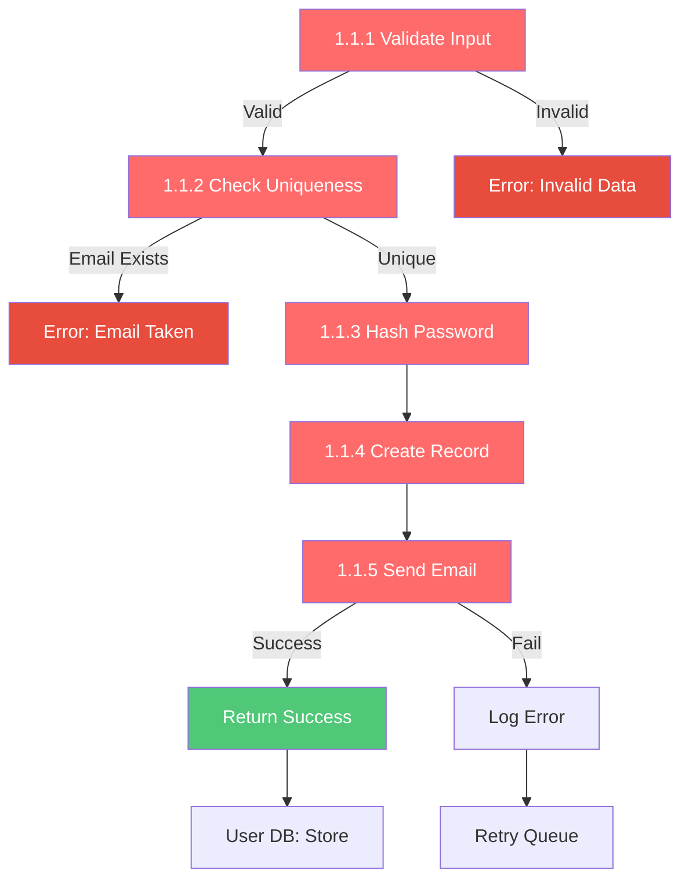
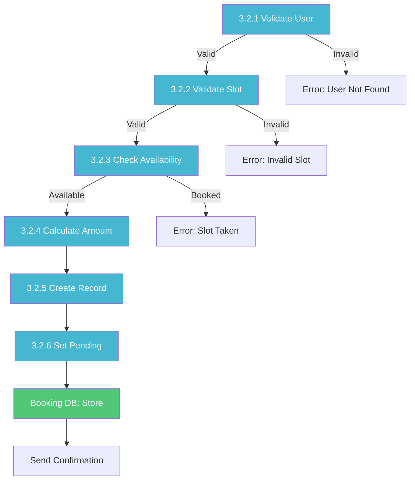
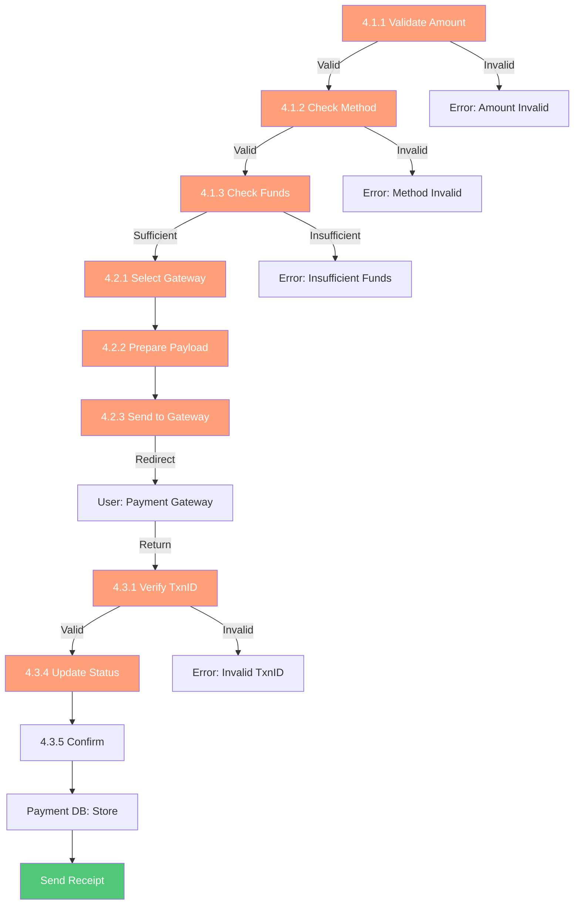

# 📊 DFD Level 2 - AllFootsal Booking System (Detailed Sub-processes)

**Document Version:** 1.0  
**Last Updated:** June 2026  
**Created for:** AllFootsal Futsal Booking Platform

---

## 📋 Table of Contents

1. [Overview](#overview)
2. [Purpose](#purpose)
3. [Level 2 Processes Overview](#level-2-processes-overview)
4. [Process Categories](#process-categories)
5. [Detailed Process Flow Diagrams](#detailed-process-flow-diagrams)
6. [Data Flow Specifications](#data-flow-specifications)
7. [Error Handling & Validation](#error-handling--validation)

---

## Overview

**Level 2 DFD** provides detailed decomposition of Level 1 main processes into **sub-processes**. It shows:

- **Detailed sub-processes** (25+ processes total)
- **Specific data transformations** and operations
- **Decision points** and conditional logic
- **Data validation** and error handling
- **Intermediate data flows**
- **Process interactions** and sequences

This level provides **implementation-ready details** for developers and architects.

---

## Purpose

The Level 2 DFD serves to:
✅ Provide **detailed process specifications**  
✅ Show **data transformations** at each step  
✅ Define **validation and error handling**  
✅ Guide **implementation** decisions  
✅ Identify **system boundaries** and interactions  
✅ Enable **detailed documentation** and coding  

---

## Level 2 Processes Overview

### **Group 1: User Management (Process 1.0)**

```
1.0 User Management
├── 1.1 User Registration
│   ├── 1.1.1 Validate Input Data
│   ├── 1.1.2 Check Email Uniqueness
│   ├── 1.1.3 Hash Password
│   ├── 1.1.4 Create User Record
│   └── 1.1.5 Send Verification Email
├── 1.2 User Login & Authentication
│   ├── 1.2.1 Validate Email
│   ├── 1.2.2 Retrieve User Record
│   ├── 1.2.3 Verify Password Hash
│   ├── 1.2.4 Generate JWT Token
│   ├── 1.2.5 Create Session
│   └── 1.2.6 Return Auth Token
├── 1.3 Profile Management
│   ├── 1.3.1 Retrieve User Profile
│   ├── 1.3.2 Validate Updates
│   ├── 1.3.3 Update Profile Data
│   ├── 1.3.4 Upload Profile Picture
│   └── 1.3.5 Confirm Update
└── 1.4 Password Reset
    ├── 1.4.1 Validate Email
    ├── 1.4.2 Generate Reset Token
    ├── 1.4.3 Send Reset Email
    ├── 1.4.4 Verify Reset Token
    ├── 1.4.5 Hash New Password
    └── 1.4.6 Update Password
```

---

### **Group 2: Facility Management (Process 2.0)**

```
2.0 Facility Management
├── 2.1 Facility Registration
│   ├── 2.1.1 Validate Facility Data
│   ├── 2.1.2 Check Unique Code
│   ├── 2.1.3 Create Facility Record
│   ├── 2.1.4 Initialize Tenant Database
│   ├── 2.1.5 Create Facility Tables
│   └── 2.1.6 Send Verification Request
├── 2.2 Pitch Management
│   ├── 2.2.1 Validate Pitch Data
│   ├── 2.2.2 Check Capacity Limits
│   ├── 2.2.3 Create Pitch Record
│   ├── 2.2.4 Update Pitch Details
│   └── 2.2.5 Delete Pitch
├── 2.3 Pricing Configuration
│   ├── 2.3.1 Set Base Pricing
│   ├── 2.3.2 Apply Discounts
│   ├── 2.3.3 Set Peak Hours
│   ├── 2.3.4 Validate Price Structure
│   └── 2.3.5 Update Rates
├── 2.4 Media Management
│   ├── 2.4.1 Validate Media File
│   ├── 2.4.2 Upload to Cloudinary
│   ├── 2.4.3 Get CDN URL
│   ├── 2.4.4 Store Media Metadata
│   ├── 2.4.5 Link to Pitch/Facility
│   └── 2.4.6 Delete Media
└── 2.5 Facility Info Updates
    ├── 2.5.1 Update Location
    ├── 2.5.2 Update Operating Hours
    ├── 2.5.3 Update Facilities List
    ├── 2.5.4 Update Contact Info
    └── 2.5.5 Update Social Links
```

---

### **Group 3: Booking System (Process 3.0)**

```
3.0 Booking System
├── 3.1 Slot Availability Check
│   ├── 3.1.1 Retrieve Pitch Info
│   ├── 3.1.2 Get Time Slots
│   ├── 3.1.3 Check Bookings
│   ├── 3.1.4 Check Conflicts
│   └── 3.1.5 Return Availability
├── 3.2 Create Booking
│   ├── 3.2.1 Validate User ID
│   ├── 3.2.2 Validate Slot Selection
│   ├── 3.2.3 Check Availability Again
│   ├── 3.2.4 Calculate Amount
│   ├── 3.2.5 Create Booking Record
│   └── 3.2.6 Set Status to Pending
├── 3.3 Confirm Booking
│   ├── 3.3.1 Verify Payment
│   ├── 3.3.2 Update Booking Status
│   ├── 3.3.3 Update Slot Availability
│   ├── 3.3.4 Generate Confirmation
│   └── 3.3.5 Notify User & Owner
├── 3.4 Cancel Booking
│   ├── 3.4.1 Verify Booking ID
│   ├── 3.4.2 Check Cancellation Policy
│   ├── 3.4.3 Calculate Refund
│   ├── 3.4.4 Update Booking Status
│   ├── 3.4.5 Update Slot Availability
│   └── 3.4.6 Process Refund
└── 3.5 Update Availability
    ├── 3.5.1 Check All Bookings
    ├── 3.5.2 Calculate Free Slots
    ├── 3.5.3 Update Slot Status
    └── 3.5.4 Cache Results
```

---

### **Group 4: Payment Processing (Process 4.0)**

```
4.0 Payment Processing
├── 4.1 Payment Validation
│   ├── 4.1.1 Validate Amount
│   ├── 4.1.2 Validate Payment Method
│   ├── 4.1.3 Check User Funds
│   ├── 4.1.4 Verify Booking Exists
│   └── 4.1.5 Calculate Final Amount
├── 4.2 Gateway Integration
│   ├── 4.2.1 Select Gateway (Khalti/Esewa/Stripe)
│   ├── 4.2.2 Prepare Payment Payload
│   ├── 4.2.3 Send to Gateway
│   ├── 4.2.4 Redirect to Gateway
│   └── 4.2.5 Receive Callback
├── 4.3 Transaction Verification
│   ├── 4.3.1 Verify Transaction ID
│   ├── 4.3.2 Validate Amount
│   ├── 4.3.3 Check Signature
│   ├── 4.3.4 Update Payment Status
│   └── 4.3.5 Confirm Payment
├── 4.4 Subscription Management
│   ├── 4.4.1 Get Available Plans
│   ├── 4.4.2 Validate Plan Selection
│   ├── 4.4.3 Calculate Plan Cost
│   ├── 4.4.4 Create Subscription
│   ├── 4.4.5 Set Auto-Renewal
│   └── 4.4.6 Notify Owner
└── 4.5 Refund Processing
    ├── 4.5.1 Validate Refund Request
    ├── 4.5.2 Check Refund Policy
    ├── 4.5.3 Calculate Refund Amount
    ├── 4.5.4 Send to Gateway
    ├── 4.5.5 Update Payment Record
    └── 4.5.6 Notify User
```

---

### **Group 5: Community & Reviews (Process 5.0)**

```
5.0 Community & Reviews
├── 5.1 Review Submission
│   ├── 5.1.1 Validate Booking History
│   ├── 5.1.2 Validate Review Data
│   ├── 5.1.3 Check Duplicate Review
│   ├── 5.1.4 Store Review
│   ├── 5.1.5 Trigger Notification
│   └── 5.1.6 Confirm Submission
├── 5.2 Rating Calculation
│   ├── 5.2.1 Get All Reviews
│   ├── 5.2.2 Calculate Average
│   ├── 5.2.3 Get Rating Distribution
│   ├── 5.2.4 Update Facility Rating
│   └── 5.2.5 Cache Results
├── 5.3 Forum Management
│   ├── 5.3.1 Create Forum Post
│   ├── 5.3.2 Add Reply
│   ├── 5.3.3 Like/Unlike Post
│   ├── 5.3.4 Pin Post
│   ├── 5.3.5 Lock Discussion
│   └── 5.3.6 Delete Post
└── 5.4 Moderation & Sentiment
    ├── 5.4.1 Flag Content
    ├── 5.4.2 Review Flagged Items
    ├── 5.4.3 Remove Inappropriate
    ├── 5.4.4 Analyze Sentiment
    ├── 5.4.5 Tag Sentiment Label
    └── 5.4.6 Generate Summary
```

---

### **Group 6: Notification Management (Process 6.0)**

```
6.0 Notification Management
├── 6.1 Email Sending
│   ├── 6.1.1 Prepare Email Template
│   ├── 6.1.2 Populate Variables
│   ├── 6.1.3 Validate Email Address
│   ├── 6.1.4 Send via Nodemailer
│   ├── 6.1.5 Log Delivery
│   └── 6.1.6 Track Open/Click
├── 6.2 SMS/Push Sending
│   ├── 6.2.1 Get Device Tokens
│   ├── 6.2.2 Prepare Message
│   ├── 6.2.3 Send Push Notification
│   ├── 6.2.4 Send SMS
│   ├── 6.2.5 Log Delivery
│   └── 6.2.6 Handle Failures
├── 6.3 Status Tracking
│   ├── 6.3.1 Create Notification Record
│   ├── 6.3.2 Track Delivery Status
│   ├── 6.3.3 Record Failures
│   ├── 6.3.4 Retry Failed Items
│   └── 6.3.5 Archive Old Notifications
└── 6.4 Preference Management
    ├── 6.4.1 Retrieve User Preferences
    ├── 6.4.2 Check Notification Type
    ├── 6.4.3 Check Quiet Hours
    ├── 6.4.4 Respect Opt-Out
    └── 6.4.5 Update Preferences
```

---

### **Group 7: Admin Dashboard (Process 7.0)**

```
7.0 Admin Dashboard
├── 7.1 User Verification
│   ├── 7.1.1 Get Unverified Users
│   ├── 7.1.2 Review User Data
│   ├── 7.1.3 Verify User
│   ├── 7.1.4 Reject with Reason
│   ├── 7.1.5 Update Status
│   └── 7.1.6 Notify User
├── 7.2 Facility Verification
│   ├── 7.2.1 Get Unverified Facilities
│   ├── 7.2.2 Review Facility Data
│   ├── 7.2.3 Verify Facility
│   ├── 7.2.4 Reject with Reason
│   ├── 7.2.5 Update Status
│   └── 7.2.6 Notify Owner
├── 7.3 Dispute Resolution
│   ├── 7.3.1 Get Open Disputes
│   ├── 7.3.2 Review Complaint
│   ├── 7.3.3 Investigate
│   ├── 7.3.4 Make Decision
│   ├── 7.3.5 Process Refund if Needed
│   └── 7.3.6 Notify Parties
└── 7.4 Audit & Monitoring
    ├── 7.4.1 Monitor Transactions
    ├── 7.4.2 Track User Activity
    ├── 7.4.3 Monitor System Health
    ├── 7.4.4 Generate Alerts
    ├── 7.4.5 Log Admin Actions
    └── 7.4.6 Create Audit Trail
```

---

### **Group 8: Analytics & Reporting (Process 8.0)**

```
8.0 Analytics & Reporting
├── 8.1 Booking Analytics
│   ├── 8.1.1 Aggregate Bookings
│   ├── 8.1.2 Count by Facility
│   ├── 8.1.3 Calculate Occupancy Rate
│   ├── 8.1.4 Track Trends
│   └── 8.1.5 Store Metrics
├── 8.2 Payment Analytics
│   ├── 8.2.1 Sum Revenue
│   ├── 8.2.2 Calculate by Gateway
│   ├── 8.2.3 Track Payment Success Rate
│   ├── 8.2.4 Analyze Trends
│   └── 8.2.5 Store Metrics
├── 8.3 Report Generation
│   ├── 8.3.1 Get Date Range
│   ├── 8.3.2 Query Data
│   ├── 8.3.3 Format Report
│   ├── 8.3.4 Generate PDF
│   └── 8.3.5 Send Report
└── 8.4 Dashboard Creation
    ├── 8.4.1 Fetch Real-time Data
    ├── 8.4.2 Calculate KPIs
    ├── 8.4.3 Prepare Charts
    ├── 8.4.4 Create Dashboard
    └── 8.4.5 Cache Results
```

---

### **Group 9: Offline Booking Handler (Process 9.0)**

```
9.0 Offline Booking Handler
├── 9.1 Walk-in Booking
│   ├── 9.1.1 Validate Slot
│   ├── 9.1.2 Get Customer Info
│   ├── 9.1.3 Check Availability
│   ├── 9.1.4 Create Booking
│   └── 9.1.5 Set Status
├── 9.2 Payment Recording
│   ├── 9.2.1 Get Amount
│   ├── 9.2.2 Record Payment Method
│   ├── 9.2.3 Create Payment Record
│   ├── 9.2.4 Update Booking
│   └── 9.2.5 Update Slot
└── 9.3 Receipt Generation
    ├── 9.3.1 Format Receipt
    ├── 9.3.2 Generate QR Code
    ├── 9.3.3 Print Receipt
    └── 9.3.4 Store Copy
```

---

## Detailed Process Flow Diagrams

### **1.1 User Registration Process**



---

### **3.2 Create Booking Process**



---

### **4.1 Payment Processing Flow**



---

## Data Flow Specifications

### **Critical Data Flows in Level 2**

| Source | Destination | Data | Type | Frequency |
|--------|-------------|------|------|-----------|
| 1.1.5 | Email Service | Email + Verification Link | Output | Per Registration |
| 3.2.1 | User DB | User ID | Query | Per Booking |
| 3.2.3 | Booking DB | Booking Records | Query | Per Booking |
| 4.2.3 | Payment Gateway | Payment Payload (JSON) | Output | Per Payment |
| 4.3.1 | Payment DB | Transaction Records | Query | Per Payment |
| 5.1.5 | Notification | Review Data | Trigger | Per Review |
| 6.1.4 | Nodemailer | Email Object | Send | Real-time |
| 8.1.1 | Analytics DB | Aggregated Bookings | Write | Hourly |
| 9.1.4 | Booking DB | Offline Booking | Write | Per Walk-in |

---

## Error Handling & Validation

### **Level 2 Error Handling Strategy**

#### **1. Input Validation**
```
All incoming data must be validated for:
✓ Data type correctness
✓ Format compliance (email, phone, etc.)
✓ Range constraints (prices, counts)
✓ Mandatory field presence
✓ SQL injection prevention
✓ XSS prevention
```

#### **2. Business Logic Validation**
```
Ensure business rules are enforced:
✓ No double bookings
✓ Slot availability checking
✓ Pricing correctness
✓ Refund policy compliance
✓ Subscription status checks
```

#### **3. Database Validation**
```
Maintain data integrity:
✓ Foreign key constraints
✓ Unique constraints
✓ NOT NULL constraints
✓ Cascade delete handling
```

#### **4. Error Response Standards**
```
All Level 2 processes return:
{
  success: boolean,
  status_code: 200/400/404/500,
  message: "Error description",
  error_code: "ERROR_CODE",
  data: {} | null
}
```

---

## Process Interaction Matrix

```
        1.1 1.2 1.3 1.4 2.1 2.2 3.1 3.2 4.1 5.1 6.1 7.1 8.1 9.1
1.1      -   ✓   -   -   -   -   -   -   -   -   -   -   -   -
1.2      ✓   -   ✓   -   -   -   ✓   ✓   -   ✓   -   -   ✓   -
1.3      ✓   -   -   -   -   -   -   -   -   -   -   -   -   -
1.4      -   -   -   -   -   -   -   -   -   -   ✓   -   -   -
2.1      -   -   -   -   -   ✓   -   -   -   -   ✓   ✓   -   -
2.2      -   -   -   -   ✓   -   ✓   -   -   -   -   ✓   ✓   -
3.1      -   ✓   -   -   ✓   ✓   -   ✓   -   -   -   -   ✓   ✓
3.2      -   ✓   -   -   -   ✓   ✓   -   ✓   -   ✓   -   ✓   -
4.1      -   -   -   -   -   -   -   ✓   -   -   ✓   ✓   ✓   -
5.1      -   ✓   -   -   ✓   -   -   -   -   -   ✓   -   ✓   -
6.1      ✓   ✓   -   ✓   ✓   -   -   ✓   ✓   ✓   -   ✓   -   -
7.1      -   -   -   -   ✓   -   -   -   ✓   -   ✓   -   ✓   -
8.1      ✓   ✓   -   -   ✓   ✓   ✓   ✓   ✓   ✓   -   ✓   -   ✓
9.1      -   -   -   -   ✓   ✓   ✓   ✓   ✓   -   ✓   -   ✓   -

✓ = Process interaction exists
- = No direct interaction
```

---

## Performance Considerations

### **Database Indexing Strategy**
```
Index on:
- users(email) - Fast email lookup
- bookings(pitch_id, booking_date) - Availability checks
- payments(user_id, status) - Payment tracking
- ratings(facility_id) - Average rating calculation
- facilities(futsalCode) - Facility lookup
```

### **Caching Strategy**
```
Cache for:
- Facility listings (5 mins)
- Availability slots (1 min)
- Rating calculations (1 hour)
- User profiles (10 mins)
- Analytics data (1 hour)
```

### **Async Processing**
```
Process asynchronously:
- Email sending (6.1)
- SMS sending (6.2)
- Analytics aggregation (8.1, 8.2)
- PDF report generation (8.3)
- Sentiment analysis (5.4.4)
```

---

## Document Information

- **Diagram Type**: Detailed Sub-processes (Level 2)
- **System**: AllFootsal Futsal Booking Platform
- **Created**: June 2026
- **Version**: 1.0
- **Sub-processes**: 25+
- **Decision Points**: 15+
- **Error Scenarios**: 20+

---

## References

- 📄 [Level 0 DFD](DFD_LEVEL_0_README.md) - Context Diagram
- 📄 [Level 1 DFD](DFD_LEVEL_1_README.md) - Main Processes
- 📊 Database ER Diagram - Entity Relationships
- 📋 API Documentation - RESTful Endpoints
